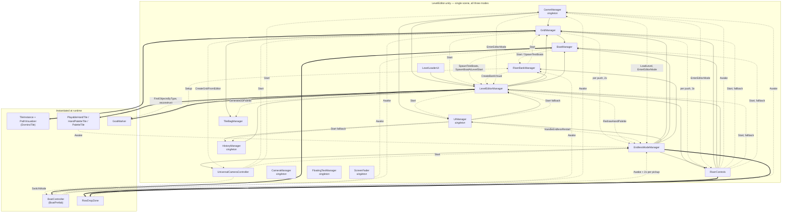
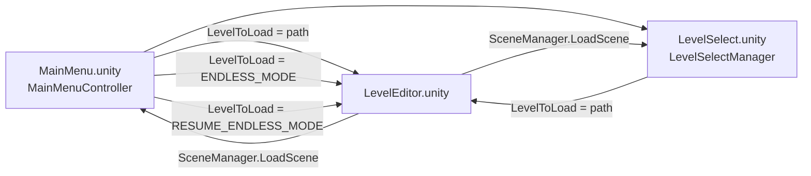
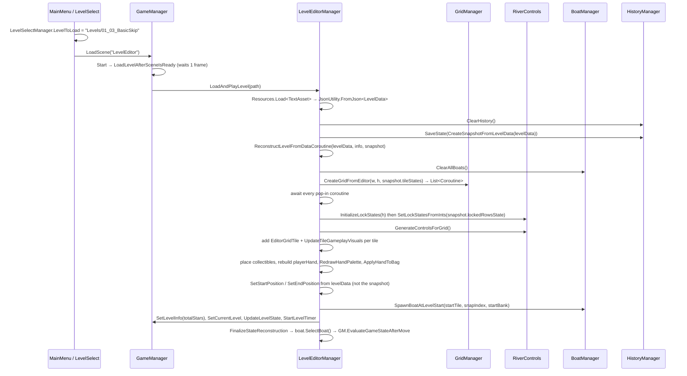
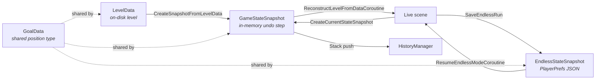

# Hapi's Havoc — Architecture Reference

Unity **6000.2.0b8**, Universal Render Pipeline, mobile target (Android minSdk 23, iOS).
Product `Hapi's Havoc`, bundleVersion `0.1.1`. Input: new Input System (`InputSystem_Actions`).
Cinemachine 3.x (`Unity.Cinemachine` namespace).

Scope of this document: everything under `Assets/_Project/Scripts` (53 runtime scripts + 1 editor
script), `Assets/Resources/Levels/*.json`, `Assets/Settings/*.asset`, and the prefabs/scenes that
wire them together. `Assets/TextMesh Pro`, `Library/`, `Temp/`, `obj/`, `BUILDS/` are out of scope.

Where a claim could not be verified from the repository alone it is marked **UNVERIFIED** with
the reason. Those are real gaps, not hedging — treat them as things to check in the Editor.

---

## 1. System map

`Assets/_Project/Scenes/LevelEditor.unity` is the only gameplay scene and hosts exactly one
instance of each manager. Solid arrows are serialised Inspector references; dashed arrows are
resolved at runtime via `FindFirstObjectByType` (or, in three cases, `FindObjectsByType`).

### Cross-scene entry points

`LevelSelectManager.LevelToLoad` is a **`public static string`** — the only cross-scene channel.
It is set by `MainMenuController`, `LevelSelectManager.OnMarkerClicked`, `GameManager.LoadNextLevel`,
`UIManager.OnEndlessRetryClicked`, and `EndlessModeManager.RestartEndlessRun`, then consumed and
nulled by `GameManager.LoadLevelAfterSceneIsReady()`.

### Full `FindFirstObjectByType` / `FindObjectsByType` inventory

| Caller | Line | Target | Frequency |
|---|---|---|---|
| `BoatController` | 120–127 | `BoatManager`, `GridManager`, `RiverBankManager`, `GameManager`, `EndlessModeManager` | Awake (fine) |
| `BoatController` | 509, 531 | `EndlessModeManager` | **once per collectible pickup** |
| `BoatManager` | 40, 52, 53, 176 | `RiverBankManager`, `LevelEditorManager` | per spawn |
| `GameManager` | 72, 113, 130, 455, 461 | `UIManager`, `EndlessModeManager`, `RiverControls`, `LevelEditorManager` | Awake / mode switch |
| `GoalMarker` | 38 | `RiverBankManager` | per bank marker Setup |
| `GridManager` | 99, 179 | `LevelEditorManager`, `UniversalCameraController` | Start / grid rebuild |
| `GridManager` | 450, 796, 1117 | `RiverControls` | **once per row push** |
| `GridManager` | 1034, 1294 | `EndlessModeManager` | **once per row push** |
| `LevelEditorManager` | 134, 520, 800 | `UIManager`, `TileBagManager`, `EndlessModeManager` | Start / palette redraw |
| `LevelEditorManager` | 1882 | `FindObjectsByType<GoalMarker>` | **once per level reconstruct / undo** |
| `PlayableHandTile` | 67 | `EndlessModeManager` | Awake per hand tile |
| `PlayableHandTile` | 207, 279 | `FindFirstObjectByType<HandTileStandIn>` | per drag end |
| `RiverBankManager` | 42, 167 | `GridManager`, `LevelEditorManager` | **once per bank visual created** |
| `RiverControls` | 65, 73–77, 710 | `GameManager`, `LevelEditorManager`, `BoatManager`, `GridManager` | Awake/Start |
| `RowDropZone` | 45 | `GameManager` | **Awake of every drop zone** |
| `UIManager` | 121, 126, 413 | `LevelEditorManager`, `HistoryManager`, `EndlessModeManager` | Start / button |
| `UniversalCameraController` | 103–105, 451 | `GridManager`, `GameManager`, `EndlessModeManager`, `BoatController` | Start / mode switch |
| `WaterResizer` | 16 | `GridManager` | Start |
| `LevelSelectManager` / `LevelSelectCameraController` | 32 / 181, 190 | `FindObjectsByType<LevelMarker>` | Start (LevelSelect scene) |

None are in `Update()`. The hot ones are the per-push and per-drop-zone lookups.

---

## 2. Per-file reference

Line counts are exact (`wc -l`). Files over 400 lines are flagged.

### Core managers

#### `GameManager.cs` — 530 lines
*Owns the mode/state machine, win-loss evaluation and star scoring.*
- **Public API:** `Instance`, `currentState`, `currentMode`, `currentLevelData`, `currentLevelInfo`,
  `StartLevelTimer()`, `UpdateLevelState(LevelData, GameObject)`, `EvaluateGameStateAfterMove(BoatController)`,
  `OnEndGoalDestroyed()`, `SetLevelInfo(int)`, `SetReconstructing(bool)`, `SetOperatingMode(OperatingMode)`,
  `EnterEditorMode()`, `SetCurrentLevel(LevelData, LevelInfo)`, `LoadNextLevel()`.
- **Called by:** `BoatController` (`EvaluateGameStateAfterMove` after each move),
  `LevelEditorManager` (`SetCurrentLevel`, `UpdateLevelState`, `SetLevelInfo`, `SetReconstructing`,
  `StartLevelTimer`), `GoalMarker.OnDestroy` (`OnEndGoalDestroyed`), `HistoryManager`, `UIManager`,
  and scene UnityEvents (`EnterEditorMode`, `LoadNextLevel` via button `m_MethodName`).
- **Calls out to:** `UIManager` (result screens), `LevelEditorManager.LoadAndPlayLevel`,
  `EndlessModeManager.StartEndlessMode` / `ResumeEndlessMode`, `CameraManager`, `PlayerPrefs`, `SceneManager`.
- Star score is computed in `CalculateFinalScore`: start at 3, −1 if `currentMovementPoints <=
  movePenaltyThreshold` (default 0), −1 if not all stars collected, −1 if undo was used, clamped to ≥1.
  Persisted to `PlayerPrefs` key `Level_{WW:00}_{LL:00}_Stars` only when higher than the stored value.

#### `GridManager.cs` — 1892 lines ⚠ **COMPLEXITY: god object**
*Owns the tile grid array, tile instantiation, all row-push mechanics and ejection physics.*
- **Public API:** `OnTileConsumed` (event), grid config fields (`rows`, `cols`, `tileWidth`,
  `tileHeight`, `gapX`, `gapZ`, `tilePrefab`, `gridParent`, `bagManager`, `isPuzzleMode`),
  `CreateGridFromEditor(int,int,List<TileSaveData>,bool)` → `List<Coroutine>`,
  `GetWorldPosition(int,int)`, `GetSpawnPosition(int,bool)`, `GetTileCoordinates(TileInstance)`,
  `PushRowFromSide(int,bool,bool)`, `PushRowCoroutine` ×3 overloads,
  `InitializeTile(TileInstance,TileType,bool)`, `ConvertPaths(List<Vector2Int>)`,
  `IsPushInProgress()`, `GetTileAt(int,int)`, `SetGridTilesLayer(string)`,
  `UpdateTileGameplayVisuals(TileInstance)`, `CreateNewEndlessRow(...)`,
  `DestroyEndlessRow(int,List<TileInstance>)`, `ExpandGridForEndless(int)`, `GetTilesInRow(int)`,
  `FindTileAndSnapPointAtWorldPos(Vector3)`.
- **Called by:** `LevelEditorManager` (grid creation, pushes, visuals), `EndlessModeManager`
  (board setup, streaming, pushes), `RiverControls` (`PushRowFromSide`, `IsPushInProgress`,
  `GetWorldPosition`, `GetTileAt`), `BoatController` (`GetTileAt`, `GetTileCoordinates`,
  `FindTileAndSnapPointAtWorldPos`, `cols`/`rows`), `UniversalCameraController`, `WaterResizer`,
  `PlayableHandTile` (`SetGridTilesLayer`).
- **Calls out to:** `TileBagManager`, `BoatController` (fade/animate/eject callbacks),
  `BoatManager`, `RiverControls` (collider enable), `EndlessModeManager` (camera target),
  `HistoryManager.SaveState`, `PathVisualizer.CleanUpPaths`, `UniversalCameraController.OnGridChanged`.

#### `BoatController.cs` — 1919 lines ⚠ **COMPLEXITY: god object**
*Owns everything about the boat: pathfinding, selection, highlighting, all animation, collectibles.*
- **Public API:** `GetCurrentTile()`, `GetCurrentSnapPoint()`, `CurrentBank`, `isSelected`,
  `maxMovementPoints`, `currentMovementPoints`, `starsCollected`, `extraMovesCollected`,
  `snapOffset`, `starCounterText`, `moveCounterText`,
  `UpdateMoveCounterUI()`, `InitializeStateOnTile(TileInstance,int)`, `FadeOutForEjection()`,
  `SetAtBank(Transform)`, `MoveToBank(BankSide)`, `OnPointerClick(...)`,
  `AnimateToNewPositionAfterEjection(...)` ×3 overloads, `SelectBoat()`, `DeselectBoat()`,
  `CheckForCollectibleOnCurrentTile()`, `ApplyPenaltiesForForcedMove(List<TileInstance>)`,
  `PrepareForForcedMove()`, `OnTileClicked(TileInstance,PointerEventData)`,
  `OnBankClicked(BankSide)`, `SetCollectedStars(int)`, `EndMovementTurn()`,
  `ResetStateAfterEjection()`, `ResetMovementPoints()`, `static GetSnapPointRotation(TileInstance,int)`,
  `PlaceOnTile(TileInstance,int)`, `CompleteMovement()`.
- **Called by:** `GridManager` (ejection choreography), `BoatManager` (spawn/placement),
  `EndlessModeManager` (select/deselect/complete), `LevelEditorManager` (undo restore, max-moves),
  `SimpleTileClickHandler` (defined at the bottom of this same file), `BankClickHandler`.
- **Calls out to:** `GridManager`, `RiverBankManager`, `BoatManager`, `GameManager`,
  `EndlessModeManager`, `HistoryManager`, `FloatingTextManager`, `PathVisualizer`, `EmbarkArrow`.

#### `LevelEditorManager.cs` — 2333 lines ⚠ **COMPLEXITY: god object, largest file**
*Editor tooling, hand management, JSON persistence, and the level-reconstruction pipeline that
Playing mode and Undo also depend on.*
- **Public API:** `gridManager`, `currentLoadedLevelData`, `CreateCurrentStateSnapshot()`,
  `GetCurrentMaxMoves()`, `ApplyHandToBag()`, `ApplySandboxBag()`, `OnPaletteTileClicked(PaletteTile)`,
  `OnHandPaletteTileClicked(HandPaletteTile)`, `RedrawHandPalette()`, `UpdateHandCounters()`,
  `OnGridTileClicked(TileInstance)`, `OnBankClicked(BankSide)`,
  `HandleArrowPush(int,bool,bool)`, `HandleDropZonePush(int,bool,TileType,GameObject)`,
  `SaveLevel()`, `LoadLevelFromFile(string)`, `RestartCurrentLevel()`,
  `ReconstructLevelFromDataCoroutine(LevelData,LevelInfo,GameStateSnapshot,bool)`,
  `OnMaxMovesChanged(string)`, `PlaytestCurrentLevel()`, `LoadAndPlayLevel(string)`.
- **Called by:** `GameManager`, `UIManager`, `HistoryManager` (undo replays through
  `ReconstructLevelFromDataCoroutine`), `RiverControls` (`HandleArrowPush`),
  `PlayableHandTile` (`HandleDropZonePush`), `EditorGridTile`, `PaletteTile`, `HandPaletteTile`,
  `EditorBankClickHandler`, `LevelLoaderUI`, `BoatManager`, scene UnityEvents (`PlaytestCurrentLevel`).
- **Calls out to:** `GridManager`, `RiverControls`, `RiverBankManager`, `BoatManager`,
  `GameManager`, `HistoryManager`, `UIManager`, `ScreenFader`, `CameraManager`, `PathVisualizer`.

#### `EndlessModeManager.cs` — 1229 lines ⚠ **COMPLEXITY: god object**
*Endless run: stamina/AP economy, storm forecast, world streaming, camera proxy, save/resume.*
- **Public API:** `ResetCameraOffset()`, `StartEndlessModeCoroutine()`, `SpendActionPoint()`,
  `EndPlayerTurn()`, `StartEndlessMode()`, `OnBoatClicked()`,
  `HandleEndlessPush(RowDropZone,TileType,GameObject)`, `UpdateCameraTargetToBoatPosition()`,
  `AddStamina(int)`, `ResumeEndlessMode()`, `RestartEndlessRun()`, `TriggerGameOverByEjection()`.
- **Called by:** `GameManager` (start/resume), `BoatController` (`SpendActionPoint`, `AddStamina`,
  `OnBoatClicked`, `TriggerGameOverByEjection`), `GridManager` (`UpdateCameraTargetToBoatPosition`),
  `PlayableHandTile` (`HandleEndlessPush`), `UIManager` (`RestartEndlessRun`), scene UnityEvent
  (`EndPlayerTurn`).
- **Calls out to:** `GridManager`, `RiverControls`, `RiverBankManager`, `BoatManager`, `UIManager`,
  `CameraManager`, `UniversalCameraController`, Cinemachine `CinemachineBrain`, `PlayerPrefs`.
- Runs a `LateUpdate` every frame that drives `cameraProxy` and `endlessVCam.transform.position`.

#### `RiverControls.cs` — 813 lines ⚠ **COMPLEXITY**
*Push affordances: 3D arrows + lock toggles in Editor mode, world-space UI drop zones in
Playing/Endless. Owns `RowLockState[]`.*
- **Public API:** `showHoverEffect`, `AnimateRowForDrop(int,bool)`, `ResetRowAnimation(int)`,
  `InitializeLockStates(int)`, `GetLockStatesAsInts()`, `SetLockStatesFromInts(int[])`,
  `GenerateControlsForGrid()`, `CreateDropZonesForRow(int)`, `PushFromLeft/PushFromRight`,
  `OnLockButtonClicked(int)`, `OnArrowClicked(int,bool,bool)`, `SetArrowCollidersEnabled(bool,int)`,
  `UpdateControlsForMode()`, `GetDropZone(int,bool)`, `DestroyControlsForRow(int)`,
  `SetDropZoneCanvas(Canvas)`, `ExpandLockStates(int)`.
- **Called by:** `LevelEditorManager`, `EndlessModeManager`, `GridManager`, `GameManager`,
  `LockToggleButton`, `PointerArrowButton`, `RowDropZone`.
- `RowLockState` enum: `Unlocked=0, LeftLocked=1, RightLocked=2, BothLocked=3`. This is the
  encoding used by `LevelData.lockedRows`.

#### `UIManager.cs` — 441 lines ⚠ **COMPLEXITY**
*Singleton. Swaps the three UI containers (`editorUI_Container`, `playerUI_Container`,
`endlessUI_Container`) plus three 3D palette containers; owns win/fail/endless-score panels.*
- **Public API:** `Instance`, `ShowLevelCompleteScreen(...10 args...)`, `ShowLevelFailedScreen(string)`,
  `HandleRestart()`, `HandleNextLevel()`, `HandleReturnToMenu()`, `ResetToGameplayUI()`,
  `SwitchToMode(OperatingMode)`, `UpdateAllUndoButtons()`, `SetEditorRestartButtonInteractable(bool)`,
  `UpdateCurrentLevelName(string)`, `HandleReturnToLevelSelect()`, `ShowEndlessScoreScreen(int,int)`,
  `HandleEndlessRestart()`.
- Also declares `public struct BonusCollectibleInfo { Sprite icon; int count; }` at file scope.

#### `RiverBankManager.cs` — 390 lines
*Creates the top and bottom bank GameObjects and their boat spawn points.*
- **Public API:** `enum BankSide { Top, Bottom }`, `GenerateBanksForGrid()`, `CreateTopBank()`,
  `CreateBottomBank()`, `GetSpawnPoint(BankSide,int)`, `GetRandomSpawnPoint(BankSide)`,
  `GetAllSpawnPoints(BankSide)`, `GetBankGameObject(BankSide)`,
  `GetNearestSpawnPoint(BankSide,Vector3)`, `DestroyBottomBank()`, `ClearAllBanks()`,
  `GetCenterSpawnPoint(BankSide)`.
- In the scene `bankPrefab` is **null**, so banks are `GameObject.CreatePrimitive(Cube)` scaled to
  river width, with `Bank_Base_Mat` applied via `sharedMaterial`. `spawnPointsPerSide = 1`.

#### `BoatManager.cs` — 284 lines
*Boat lifecycle and the selected-boat registry.*
- **Public API:** `boatPrefab`, `SetSelectedBoat(BoatController)`, `ClearSelectedBoat()`,
  `GetSelectedBoat()`, `SpawnTestBoats()`, `RespawnAllBoats()`,
  `SpawnBoatAtLevelStart(TileInstance,int,BankSide?)`, `ClearAllBoats()`, `GetPlayerBoats()`,
  `SpawnPlayerBoat(BankSide)`, `SpawnBoatWithoutPositioning()`.
- Has an `Update()` that calls `Keyboard.current.bKey.wasPressedThisFrame` → `RespawnAllBoats()`.
  This is a live debug hotkey in shipping builds, and it dereferences `Keyboard.current` without a
  null check (throws on a touch-only device where no keyboard is present).

#### `UniversalCameraController.cs` — 516 lines ⚠ **COMPLEXITY**
*Cross-platform pan (mouse + `Touchscreen`) with per-mode `PanSettings`; feeds Endless via an offset.*
- **Public API:** `IsPlayerControllingCamera`, `GetEndlessCameraOffset()`, `ResetEndlessOffset()`,
  `SetEndlessBaseTarget(Vector3)`, `OnGridChanged()`.
- Its `Update()` compares `currentSettings != GetSettingsForMode(gameManager.currentMode)` by
  reference each frame to detect mode changes — cheap, but implicit.

#### `CameraManager.cs` — 60 lines
Singleton; three `CinemachineCamera` refs, switches by `Priority` 20/10.
`SwitchToEditorView` / `SwitchToPlayerView` / `SwitchToEndlessView`.
Note `SwitchToEditorView` and `SwitchToPlayerView` null-check only `editorCamera` and
`playerCamera` but then dereference `endlessCamera`.

### Data / persistence

#### `LevelData.cs` — 80 lines
Plain `[System.Serializable]` classes: `TileSaveData`, `CollectibleSaveData`, `HandTileSaveData`,
`GoalData`, `LevelData`. See §4 for the schema.

#### `GameStateSnapshot.cs` — 28 lines
`tileStates`, `collectibleStates`, `lockedRowsState`, `boatMovementPoints`, `boatStarsCollected`,
`boatPosition` (a `GoalData`), `playerHandState`, `undoCount`.

#### `EndlessStateSnapshot.cs` — 22 lines
`currentStamina`, `score`, `boatPosition` (`GoalData`), `boatStarsCollected`, `tileStates`,
`collectibleStates`, `lowestGeneratedRow`, `highestGeneratedRow`.

#### `HistoryManager.cs` — 194 lines
Singleton over a `Stack<GameStateSnapshot>` (`maxHistorySteps = 20` — **declared but never
enforced**; the stack is unbounded).
- **Public API:** `Instance`, `hasUsedUndo`, `IsReady`, `ClearHistory()`,
  `SaveState(GameStateSnapshot = null)`, `Undo()`, `UpdateUndoButton(Button,Button)`, `ResetUndoFlag()`.
- `SaveState` de-dupes by `JsonUtility.ToJson`-ing both the incoming and top-of-stack snapshot and
  string-comparing them — two full serialisations on every push and every boat move.
- Undo restores by calling `LevelEditorManager.ReconstructLevelFromDataCoroutine(..., isUndoAction: true)`,
  i.e. the whole board is destroyed and rebuilt.

#### `TileLibrary.cs` — 64 lines
`ObstacleType` enum, `[Serializable] class TileType` (`displayName`, `quantity`, `frontPaths`
as `List<Vector2Int>`, `backObstacle`, `canRotate180`, `canFlip`), and the
`TileLibrary : ScriptableObject` container. Asset: `Assets/_Project/ScriptableObjects/HapiTileLibrary.asset`.

#### `TileBagManager.cs` — 173 lines
Runtime bag of `TileType` references with Fisher-Yates shuffle.
`BuildBag()`, `DrawRandomTile()`, `ReturnTile(TileType)`, `TilesRemaining`,
`BuildBagFromHand(Dictionary<TileType,int>)`, `GetCountOfTileType(TileType)`.
Its own `Start()` calls `BuildBag()`, and `GridManager.Start()` also calls `bagManager.BuildBag()` —
the bag is built twice at scene start, order-dependent but harmless.

#### `TileInstance.cs` — 34 lines
`Transform[] snapPoints` (6, assigned in the prefab), `IsReversed` (private set),
`IsHardBlocker` (public set), `[NonSerialized] TileType originalTemplate`,
`List<Connection> connections`, and `Initialise(List<Connection>, bool isReversed, TileType)`
which replaces the connection list and calls `PathVisualizer.DrawPaths()`.

#### `LevelInfo.cs` — 45 lines / `LevelFinder.cs` — 48 lines
`LevelInfo` parses `WW_LL_Description` out of a resource path. `LevelFinder.GetAllLevels()` does
`Resources.LoadAll<TextAsset>("Levels")` and returns them ordered by world then level.

#### `CollectibleType.cs` — 11 lines / `CollectibleInstance.cs` — 21 lines
`enum CollectibleType { Star = 0, ExtraMove = 1 }` and a component holding `type` + `value`.

#### `PuzzleHandTile.cs` — 21 lines
Non-MonoBehaviour data: `tileType`, `rotationY`, `isFlipped`, `System.Guid id`.

#### `HandTileAnimationSettings.cs` — 13 lines
ScriptableObject: `rotationDuration`, `rotationCurve`.

### Rendering / visuals

#### `PathVisualizer.cs` — 275 lines
*Draws each tile's connections as `LineRenderer` children and applies highlight colours.*
- **Public API:** `lineMat`, `width`, `segsPerBezier`, `highlightColor`, `defaultPathColor`,
  `highlightFadeDuration`, `DrawPaths()`, `CleanUpPaths()`,
  `HighlightPath(int startSnap, int otherSnap, bool useGradient)`, `ClearAllHighlights()`.
- Routing table in `Build(a,b)`: straights (`0-2`,`1-3`,`5-4`), quarter Béziers
  (`0-5`,`5-2`,`1-4`,`4-3`), half-arcs for U-pairs (`0-1`,`2-3`), S-pairs (`0-3`,`2-1`) as two
  chained quads through the tile centre, and quad-plus-straight for `0-4`/`2-4`/`1-5`/`5-3`.
  Snap index `6` means "centre" (`Snap_Centre`).
- Stores renderers in `Dictionary<(int,int), LineRenderer>` keyed with the **lower index first**,
  so `(5,0)` and `(0,5)` collide — see §6 for the leak this causes.

#### `GoalMarker.cs` — 116 lines
Data + follower for start/end markers. `Setup(GridManager, TileInstance, BankSide?, int?, bool isEnd)`
populates a `GoalData`; `LateUpdate` re-positions to the target tile snap point (or bank) every
frame and self-destructs when the tile is gone; `OnDestroy` notifies
`GameManager.OnEndGoalDestroyed()` when it is the end goal and the game is `Playing`.

#### `FloatingTextManager.cs` — 133 lines / `FloatingText.cs` — 78 lines
Singleton spawner for `+1` / `-N` popups. `ShowText(string, FloatingTextType, Vector3, float delay)`
and `ShowSkipBonus(int, Vector3)`. `FloatingTextType { StarGain, StarLoss, MoveGain, MoveLoss, Neutral }`.
Positions via `Camera.main.WorldToScreenPoint` into a screen-space canvas.

#### `ScreenFader.cs` — 78 lines
Singleton `CanvasGroup` fader. `FadeOut()`, `FadeIn()` coroutines; toggles `blocksRaycasts`.

#### `EmbarkArrow.cs` — 52 lines
`[RequireComponent(Animator)]`. Sets its child mesh alpha to 0 in `Awake` (via
`meshRenderer.material.color` — a material instantiation per arrow), then `TriggerFadeOutAndDestroy()`
fires the `FadeOut` animator trigger and destroys itself after `GetCurrentAnimatorStateInfo(0).length`.

#### `WaterResizer.cs` — 40 lines
Scales a Unity Plane to grid dimensions in `Start()` and sets `waterLevel` Y.
Only present in `TestingBed.unity` and `SampleScene.unity` — **not** in `LevelEditor.unity`.

#### `CounterController.cs` — 77 lines
World-space `x{n}` counter that follows a hand tile in `LateUpdate` with a fixed `Euler(90,0,0)`
rotation. `Initialize(Transform, int)`, `UpdateCount(int)` (hides itself when count ≤ 1).
The rotation-mirroring branch is commented out.

#### `FPSCounter.cs` — 47 lines
`[RequireComponent(TMP_Text)]`, averages over `updateInterval`. Present in `LevelEditor.unity`.

### Input adapters (thin components, all under 100 lines)

| File | Lines | Role |
|---|---|---|
| `EditorGridTile.cs` | 25 | `IPointerClickHandler` on grid tiles → `LevelEditorManager.OnGridTileClicked`. Added at runtime. |
| `PaletteTile.cs` | 17 | Brush palette tile click → `OnPaletteTileClicked`. |
| `HandPaletteTile.cs` | 22 | Editor hand tile click → `OnHandPaletteTileClicked`. |
| `PlayableHandTile.cs` | 366 | Play/Endless hand tile: tap-to-rotate, drag to a `RowDropZone`, stand-in duplicate, layer swapping. Routes to `LevelEditorManager.HandleDropZonePush` or `EndlessModeManager.HandleEndlessPush`. |
| `HandTileStandIn.cs` | 12 | Tag-only marker for the drag duplicate. |
| `CounterIndicatorTag.cs` | 12 | Tag-only marker for the hand counter. |
| `RowDropZone.cs` | 98 | World-space UI `Image` push target; five `VisualState`s (play-original, endless-original, highlight, forecast blue, forecast red). |
| `PointerArrowButton.cs` | 82 | Editor push arrow; `Initialize(row, fromLeft, isRed, RiverControls)`; hover tint. |
| `LockToggleButton.cs` | 25 | Lock icon click → `RiverControls.OnLockButtonClicked(row)`. |
| `BankClickHandler.cs` | 13 | Bank click during play → `BoatController.OnBankClicked`. Added/removed per highlight. |
| `EditorBankClickHandler.cs` | 15 | Bank click in editor → `LevelEditorManager.OnBankClicked`. |
| `ClickForwarder.cs` | 30 | LevelSelect: forwards mesh clicks to the parent `LevelMarker`. |
| `SimpleTileClickHandler` | — | Declared at the bottom of `BoatController.cs`, not its own file. Added/removed per highlight. |

### Menu / level select

| File | Lines | Role |
|---|---|---|
| `MainMenuController.cs` | 101 | `GoToLevelSelect`, `GoToLevelEditor`, `GoToNextAvailableLevel` (first level with 0 stars), `GoToEndlessMode` (picks RESUME vs NEW by `PlayerPrefs.HasKey("EndlessSaveFile")`), `QuitGame`. |
| `LevelSelectManager.cs` | 114 | Unlock logic (previous level must have ≥1 star; 1-1 always unlocked), `OnMarkerClicked`, `static LevelToLoad`. |
| `LevelMarker.cs` | 85 | Per-level marker: world/level number, lock visual, 3 star sprite renderers, `UpdateVisuals(int,bool)`, `HandleClick()`. |
| `LevelSelectCameraController.cs` | 264 | Full-screen invisible UI image; drag-pan with friction, click-vs-drag threshold, clamping to marker extents, intro animation. |
| `LevelLoaderUI.cs` | 83 | Editor dropdown populated from `LevelFinder.GetAllLevels()`; loads via `LevelEditorManager.LoadLevelFromFile`. |

### Debug / dev-only

| File | Lines | Note |
|---|---|---|
| `ConnectionDump.cs` | 48 | `[RequireComponent(TileInstance)]`, logs every connection in `Start()`. **It is on the `DominoTile` prefab**, so it runs for every tile spawned in a shipping build. |
| `DrawSnapGizmos.cs` | 27 | Wrapped in `#if UNITY_EDITOR`; 7 instances on the `DominoTile` prefab. Editor-only, no build cost. |
| `PhysicsDebugHelper.cs` | 136 | `Scripts/_debug/`. Not referenced by any scene or prefab. |
| `Editor/PlayerPrefsEditor.cs` | 16 | `Hapi/Clear Player Progress` menu item. Editor assembly. |

### Notes on the file list
- `Assets/_Project/Scripts/backup/` **exists but is empty** (no files, no `.meta` contents to
  reference). Nothing there is or could be referenced.
- `Assets/_Project/Scripts/_debug/` contains only `PhysicsDebugHelper.cs`.

---

## 3. The four large files — responsibilities and proposed splits

These are proposals. **Nothing here has been implemented.**

### 3.1 `GridManager.cs` (1892)

Distinct responsibilities currently held:

1. **Grid model** — the `TileInstance[,] grid` array, `boardOrigin`, `rows`/`cols`, coordinate↔world
   conversion (`GetWorldPosition`, `GetSpawnPosition`, `GetTileCoordinates`, `GetTileAt`,
   `GetTilesInRow`, `FindTileAndSnapPointAtWorldPos`).
2. **Tile factory** — `CreateTileAtGridPosition`, `InitializeTile`, `ConvertPaths`,
   `FindTileTypeByName`, Rigidbody setup, `ScaleIn` pop-in animation.
3. **Board construction** — `BuildGrid` (dead), `CreateGridFromEditor`, `CreateGameFloor`.
4. **Row push choreography** — three ~200-line `PushRowCoroutine` overloads, each doing: deselect
   boat → disable arrow colliders → obtain new tile → identify ejected/riding boats → re-parent →
   slide animations → un-parent → re-place ejected boat → return tile to bag → re-enable colliders
   → re-select boat → `SaveState`.
5. **Ejection physics** — `EjectTileToAbyss` (separation slide, Rigidbody activation, torque, fade,
   cleanup).
6. **Ejected-boat relocation** — the ~70-line block repeated in all three overloads that searches
   down/up a column past reversed tiles for a landing tile or bank.
7. **Gameplay visuals** — `UpdateTileGameplayVisuals` (blocker vs vortex marker instantiation).
8. **Endless streaming** — `CreateNewEndlessRow`, `DestroyEndlessRow`, `ExpandGridForEndless`.
9. **Layer plumbing** — `SetGridTilesLayer`, `SetLayerRecursively`.

Proposed split:

| New class | Takes over | Rough size |
|---|---|---|
| `GridModel` (plain C#, no MonoBehaviour) | 1 — array, bounds, coordinate math, lookups | ~180 |
| `TileFactory` | 2, 7 — instantiate + configure + marker visuals | ~200 |
| `BoardBuilder` | 3, 8 — full-board and per-row construction/teardown | ~250 |
| `RowPushSequencer` | 4 — **one** parameterised coroutine replacing the three overloads, taking a small `PushRequest { row, fromLeft, TileSource source }` | ~250 |
| `TileEjector` | 5 — separation, physics, fade, destroy | ~130 |
| `EjectedBoatRelocator` | 6 — the column search and bank fallback, extracted once | ~110 |
| `GridLayerUtility` (static) | 9 | ~30 |
| `GridManager` (remaining) | Inspector façade delegating to the above; keeps the public API stable | ~250 |

Highest-value first move: collapse the three `PushRowCoroutine` overloads into one. It removes
roughly 400 duplicated lines and eliminates bug class 7 in `CLAUDE.md`.

### 3.2 `BoatController.cs` (1919)

Distinct responsibilities:

1. **Positional state** — `currentTile`, `currentSnapPoint`, `isAtBank`, `bankPosition`,
   `CurrentBank`, `InitializeStateOnTile`, `SetAtBank`, `SetStateForBank`, `PlaceOnTile`,
   `ResynchronizeStateWithTransform`.
2. **Pathfinding** — `FindValidMoves`, `FindRiverPathMoves`, `FindBankEntryMoves`,
   `FindMoveAtEndOfChain`, `FindConnectedTile_HorizontalOnly`,
   `FindConnectedSnapPoint_HorizontalOnly`, `GetOppositeSnapPoint`, `DetermineEntryRow`,
   `DetermineRiverSnapPoint`, `DetermineSnapPointFromClick`, `FindClosestSnapPointsToBank`.
3. **Highlighting / affordances** — `HighlightValidMovesWithDelay`, `HighlightTile`,
   `HighlightBankForDocking`, `ClearHighlights`, `ClearNonTargetHighlights`, `LiftTileSmooth`,
   embark-arrow spawning.
4. **Animation** — `LiftAndBobBoat`, `BobBoat`, `MoveToTileCoroutine`, `MoveToBankCoroutine`,
   `SettleAndFadeInCoroutine`, `FadeOutForEjection`, `FadeOutCoroutine` (dead).
5. **Selection / input** — `OnPointerClick`, `SelectBoat`, `DeselectBoat`, `OnTileClicked`,
   `OnBankClicked`, `PrepareForForcedMove`, `CompleteMovement`.
6. **Economy** — movement points, `starsCollected`, `extraMovesCollected`, skip-bonus awarding,
   `CheckForCollectibleOnCurrentTile`, counter UI text.
7. **Geometry helpers** — `static GetSnapPointRotation`, the snap-offset switch repeated verbatim in
   three methods (`SettleAndFadeInCoroutine`, `MoveToTileCoroutine`, `PlaceOnTile`).

Proposed split:

| New class | Takes over | Rough size |
|---|---|---|
| `BoatState` (plain C#) | 1 | ~120 |
| `RiverPathfinder` (plain C#, takes a grid view) | 2 — **fully unit-testable, no MonoBehaviour** | ~350 |
| `MoveHighlighter` | 3 | ~250 |
| `BoatAnimator` | 4 | ~300 |
| `BoatEconomy` | 6 | ~150 |
| `SnapGeometry` (static) | 7 — one `GetBoatPose(TileInstance, int, float offset)` used everywhere | ~80 |
| `BoatController` (remaining) | 5 — input + orchestration only | ~250 |

`RiverPathfinder` is the highest-value extraction: it is the game's actual rule engine, it has no
Unity dependencies beyond `Transform.position`, and it currently has zero tests.

### 3.3 `LevelEditorManager.cs` (2333)

Distinct responsibilities:

1. **Tool state machine** — `EditorTool` enum, all `Select*Tool` methods, `UpdateToolButtonVisuals`,
   `SetButtonColor`, `UpdateBagButtonVisuals`, `SetBagButtonColor`.
2. **Tile editing operations** — `PaintTile`, `RotateTile`, `FlipTile`, `ToggleTileBlocker` (×2),
   `PlaceOrRemoveCollectible` (×2), `SetStartPosition` (×2), `SetEndPosition`.
3. **Brush palette** — `Generate3DPalette`, `OnPaletteTileClicked`, `HighlightPaletteTile`,
   `ClearPaletteHighlight`, `LiftTileSmooth`.
4. **Player hand model + view** — `playerHand`, `AddToHand`, `RemoveFromHand`, `RedrawHandPalette`,
   `UpdateHandCounters`, `AnimateHandReCenteringCoroutine`, `ApplyHandToBag`, `ApplySandboxBag`,
   `initialHandBlueprint`, `ClearHandHighlight`, `OnHandPaletteTileClicked`.
5. **Push routing** — `HandleArrowPush`, `HandleDropZonePush`.
6. **Persistence** — `SaveLevel` (JSON write + `AssetDatabase.Refresh`), `LoadLevelFromFile`,
   `CreateSnapshotFromLevelData`, `CreateCurrentStateSnapshot`, `FindTileTypeByName`.
7. **Level reconstruction** — `ReconstructLevelFromDataCoroutine` (~250 lines),
   `FinalizeStateReconstruction`, `RestartCurrentLevelCoroutine`. **Used by Editor, Playing and
   Undo alike** — this is not editor-only code.
8. **Mode transitions** — `PlaytestCurrentLevel`, `LoadAndPlayLevel`, `GetCurrentMaxMoves`,
   `OnMaxMovesChanged`.

Proposed split:

| New class | Takes over | Rough size |
|---|---|---|
| `LevelSerializer` (static) | 6 — `LevelData ⇄ JSON`, `LevelData ⇄ GameStateSnapshot` | ~200 |
| `LevelReconstructor` (MonoBehaviour) | 7 — **extract first; it is the shared runtime path, not editor tooling** | ~350 |
| `PlayerHandModel` (plain C#) | 4-model — the `List<PuzzleHandTile>` and its mutations | ~120 |
| `HandPaletteView` | 4-view — spawning/animating hand visuals and counters | ~300 |
| `BrushPaletteView` | 3 | ~180 |
| `TileEditOperations` | 2 | ~350 |
| `EditorToolbar` | 1 | ~200 |
| `PushRouter` | 5 | ~150 |
| `LevelEditorManager` (remaining) | 8 + Inspector wiring | ~250 |

Naming note: after the split, `LevelReconstructor` and `LevelSerializer` should not live under an
"Editor" namespace — they are runtime dependencies of Playing and Undo.

### 3.4 `EndlessModeManager.cs` (1229)

Distinct responsibilities:

1. **Game loop** — `EndlessGameLoop` (forecast → player turn → cleanup → push → generate),
   `StartEndlessModeCoroutine`, `SetupBoardCoroutine`, `EndTurnCleanupCoroutine`, `EndGame`.
2. **Economy** — `currentStamina`, `currentAP`, `score`, `highScore`, `SpendActionPoint`,
   `AddStamina`, `UpdateScore`, `EndPlayerTurn`, `OnBoatClicked`, `FinalizeBoatStateAfterMove`.
3. **Storm forecast** — `PlannedPush` class, `PlanSinglePush`, `plannedPushes`, forecast show/hide.
4. **World streaming** — `GenerateMissingRows`, `DestroyOldRows`, `GenerateNewRowsIfNeeded`,
   `CleanupOldRows`, `UpdateWorldBounds` (dead), `highestGeneratedRow`/`lowestGeneratedRow`.
5. **Camera** — `LateUpdate` proxy driving, `cameraTargetPosition`, `UpdateCameraTargetToBoatPosition`,
   `ResetCameraOffset`, `CinemachineBrain` blend override.
6. **Persistence** — `SaveEndlessRun`, `ResumeEndlessMode`, `ResumeEndlessModeCoroutine`,
   `RestartEndlessRun`, `PlaceCollectibleOnTile`.
7. **UI** — `UpdateScoreUI`, `UpdateStaminaUI`, `UpdateAPUI`, `UpdateHighScoreUI`.
8. **Tile source** — `GetRandomTileFromLibrary` (a second, parallel bag implementation that ignores
   `TileBagManager` entirely).

Proposed split:

| New class | Takes over | Rough size |
|---|---|---|
| `EndlessLoop` | 1 | ~250 |
| `EndlessEconomy` | 2 + 7 | ~200 |
| `StormForecaster` | 3 | ~120 |
| `EndlessWorldStreamer` | 4 | ~200 |
| `EndlessCameraRig` | 5 — the only per-frame code; keep it isolated | ~120 |
| `EndlessSaveService` (static) | 6 | ~180 |
| `InfiniteTileSource` | 8 — or delete and reuse `TileBagManager` | ~40 |
| `EndlessModeManager` (remaining) | Inspector façade + public entry points | ~150 |

---

## 4. Data flow

### 4.1 End-to-end: JSON → runtime → snapshot → restore

Runtime mutation and re-capture:

- **Boat move** → `BoatController.MoveToTileCoroutine` → `RefreshMovementOptionsCoroutine` →
  `HistoryManager.SaveState()` (no argument ⇒ `LevelEditorManager.CreateCurrentStateSnapshot()`
  walks the whole grid) → `GameManager.EvaluateGameStateAfterMove`.
- **Row push** → `LevelEditorManager.HandleArrowPush` / `HandleDropZonePush` calls
  `HistoryManager.SaveState()` **before** the push, and `GridManager.PushRowCoroutine` calls it
  again **after**. Two snapshots per push.
- **Undo** → `HistoryManager.UndoLastStateCoroutine` pops the current snapshot, peeks the previous,
  and replays it through `ReconstructLevelFromDataCoroutine(..., isUndoAction: true)`. The
  `isUndoAction` branch restores boat position/stats from the snapshot rather than from
  `levelData.startPosition`. `isUndoing` suppresses re-entrant `SaveState` calls during replay.
- **Endless** → after each storm-push cycle, `SaveEndlessRun()` serialises an
  `EndlessStateSnapshot` to `PlayerPrefs["EndlessSaveFile"]`. `ResumeEndlessMode` rebuilds the
  world from it and deletes the key on game over.

### 4.2 `LevelData` JSON schema — field by field

Serialised with `JsonUtility.ToJson(levelData, true)`. All six shipped levels contain exactly the
nine top-level keys below, in this order.

| Field | Type | Meaning |
|---|---|---|
| `gridWidth` | `int` | Number of columns. All six levels: `3`. |
| `gridHeight` | `int` | Number of rows. All six levels: `3`. |
| `maxMoves` | `int` | Move-point budget for the boat. Shipped range 3–5. |
| `lockedRows` | `int[]` | One entry per row, bottom (index 0) upward. Values are `RowLockState`: `0 = Unlocked`, `1 = LeftLocked`, `2 = RightLocked`, `3 = BothLocked`. |
| `tiles` | `TileSaveData[]` | The board. Always `gridWidth × gridHeight` entries in the shipped levels; sparse arrays are supported by the loader (blueprint mode creates only listed cells). |
| `collectibles` | `CollectibleSaveData[]` | Pickups placed on tiles. |
| `playerHand` | `HandTileSaveData[]` | The finite push inventory. Empty in levels 01–03. |
| `startPosition` | `GoalData` | Where the boat starts. |
| `endPosition` | `GoalData` | The win condition. |

**`TileSaveData`**

| Field | Type | Meaning |
|---|---|---|
| `tileTypeName` | `string` | Looked up by exact match against `TileType.displayName` in `HapiTileLibrary`. Includes the misspelled `TileThriughTurn_01` / `TileThriughTurn_02`. If no match, `GridManager.CreateTileAtGridPosition` logs an error and **skips the tile**, leaving a null grid cell. |
| `gridX` | `int` | Column, 0-based, left to right. |
| `gridY` | `int` | Row, 0-based, **bottom to top** (row 0 is the bottom bank edge). |
| `rotationY` | `float` | Y-axis rotation in degrees. Only `0` and `180` are meaningful. Files contain float noise (`0.000005008956122765085`) — always compare with `Mathf.RoundToInt`. |
| `isFlipped` | `bool` | `true` = reversed/vortex side. On load, `GridManager` builds rotation `Euler(isFlipped ? 180 : 0, rotationY, 0)` — i.e. `isFlipped` is an **X-axis** 180° flip. |
| `isHardBlocker` | `bool` | Impassable rock. Only meaningful when `isFlipped` is `true`; a `true`/`false` combination is accepted by the loader but `UpdateTileGameplayVisuals` renders no marker for it. |

**`CollectibleSaveData`**

| Field | Type | Meaning |
|---|---|---|
| `gridX`, `gridY` | `int` | Tile the collectible sits on (spawned at tile position + `Vector3.up * 0.25`). |
| `type` | `int` (enum) | `0 = Star`, `1 = ExtraMove`. |
| `value` | `int` | Payload. Stars ignore it (always +1 star). `ExtraMove` grants `value` move points in Puzzle mode, or `value` stamina in Endless. Shipped values: `1` for stars, `2` for extra moves. |

**`HandTileSaveData`**

| Field | Type | Meaning |
|---|---|---|
| `tileTypeName` | `string` | Same lookup rules as `TileSaveData`. Unknown names are silently dropped during reconstruction (`if (type != null)`). |
| `rotationY` | `float` | Pre-set orientation; the player can rotate further at play time. |
| `isFlipped` | `bool` | Whether the hand tile starts on its reversed side. |

One entry = one physical tile. Duplicates are expected (level 06 has nine entries: 3× `TileTurn_01`,
3× `TileTurn_02`, 3× `TileTurn_03`) and are grouped by type for display with an `x{n}` counter.

**`GoalData`** (used for both `startPosition`, `endPosition`, and — reused — for boat position
inside `GameStateSnapshot` and `EndlessStateSnapshot`)

| Field | Type | Meaning |
|---|---|---|
| `isBankGoal` | `bool` | `true` ⇒ the goal is a bank; the tile fields are ignored. |
| `tileX`, `tileY` | `int`, default `-1` | Target tile coordinates when `isBankGoal` is false. `-1` is the "not set" sentinel. |
| `snapPointIndex` | `int`, default `-1` | Snap point 0–5. Meaningful for `startPosition` (where the boat is placed) and for boat-position snapshots. `endPosition` always stores `-1` — the win check is tile-level, not snap-level. |
| `bankSide` | `int` (enum) | `0 = Top`, `1 = Bottom`. Only read when `isBankGoal` is `true`. |

**Unknown and missing fields.** `JsonUtility` is not a general JSON parser:
- **Unknown keys in the file are silently discarded.** Adding a field to a level JSON that has no
  matching C# field is a no-op — no error, no warning.
- **Missing keys are left at the C# field's default.** `int` → `0`, `bool` → `false`,
  `float` → `0`, `string` → `null`, `List<T>` → the field initialiser in `LevelData`
  (`new List<...>()`, so empty, not null). `GoalData` initialisers give `tileX/tileY/snapPointIndex
  = -1`. **However**, if a `GoalData` object is present in the JSON but omits `tileX`, JsonUtility
  writes `0` over the `-1` initialiser — an omitted field inside a present object becomes `0`, not
  the initialiser value. This is the one place where "missing" and "default" diverge dangerously.
- **A missing `startPosition`/`endPosition` object entirely** leaves the field `null`;
  `ReconstructLevelFromDataCoroutine` null-checks both, so no marker is placed.
- **Adding a new field is therefore backward compatible** with the six existing levels as long as
  its zero-value is a valid meaning. Removing or renaming a field is not.

**Observed quirk in the shipped levels.** Levels `01_01`, `01_02` and `01_04` have
`startPosition = { isBankGoal: false, tileX: -1, tileY: -1, snapPointIndex: -1 }` — neither branch
of the start-placement code fires, no start marker is created, `startTile`/`startBank` stay null,
and `BoatManager.SpawnBoatAtLevelStart` falls through to its failsafe `SpawnTestBoats()` (bottom
bank, centre spawn point). These levels rely on that failsafe.

### 4.3 Snapshot relationships

- `GameStateSnapshot` and `LevelData` share the same element types (`TileSaveData`,
  `CollectibleSaveData`, `HandTileSaveData`, `GoalData`) but are **not** the same class.
  `CreateSnapshotFromLevelData` copies the `List<>` references straight across — the snapshot and
  the `LevelData` alias the same lists, so mutating one mutates the other. Nothing currently
  mutates them in place, but it is a live aliasing hazard.
- `GameStateSnapshot` adds boat stats and hand state that `LevelData` does not track separately;
  `LevelData` adds `gridWidth`/`gridHeight`/`maxMoves` that the snapshot does not carry.
  Reconstruction therefore always needs **both** a `LevelData` (for dimensions and goals) and a
  `GameStateSnapshot` (for the mutable state).
- `EndlessStateSnapshot` is completely separate from `HistoryManager` — Endless mode has no undo.
  It adds `lowestGeneratedRow`/`highestGeneratedRow`, which `GameStateSnapshot` has no equivalent
  of, and omits `lockedRowsState` and `playerHandState` (Endless has neither locks nor a finite hand).

---

## 5. Rendering and visuals inventory

### 5.1 Materials — `Assets/_Project/Materials`

| Material | Shader | Surface / queue | Where used |
|---|---|---|---|
| `Arrow_Material` | *unresolved GUID `0406db5a…`* — a URP built-in (has `_BaseColorAddSubDiff`, i.e. a Particles variant) | Transparent, queue 3000, ZWrite off | `EmbarkArrowPrefab` |
| `Bank_Base_Mat` | URP Lit (`933532a4…`) | Opaque | Assigned to `RiverBankManager.bankMaterial` in `LevelEditor.unity`, `SampleScene`, `TestingBed`; applied via `sharedMaterial` to the runtime bank cubes |
| `Boat_Base_Material` | `Lit_ZWrite.shadergraph` | **Transparent** (`_Surface: 1`), ZWrite forced on | `BoatPrefab` — transparency is required by `FadeOutForEjection` / `SettleAndFadeInCoroutine` |
| `GreenMarkerMat` | URP Lit | Opaque | `StartMarker.prefab` |
| `Lock_Mat` | URP Lit | Opaque | `RiverControls.lockMaterial` (unlocked state) |
| `Locked_Mat` | URP Lit | Opaque | `RiverControls.lockedMaterial` (locked/greyed state) |
| `PathHighlightMaterial` | `PathHighlightShader.shadergraph` (Unlit, opaque, ZWrite off) | Opaque, multiplies **vertex colour** | `PathVisualizer.lineMat` on `DominoTile.prefab` — this is what all tile path lines render with |
| `RedMarkerMat` | URP Lit | Opaque | `EndMarker.prefab` |
| `TilePath_Mat` | *unresolved GUID `650dd952…`* (URP Unlit family) | Opaque, queue 2000 | `ExtraMove.prefab` |
| `Tile_Base_Mat` | `Lit_ZWrite.shadergraph` | **Transparent** (`_Surface: 1`) | `DominoTile.prefab` tile body — transparency is required by `EjectTileToAbyss`'s fade |
| `Tile_Pallet_Highlight_Mat` | same family as `TilePath_Mat` | Opaque, alpha 0.32 in `_BaseColor` | `Star.prefab` (despite the name) |
| `UI_Gradient_Material` | `UI_Background_Shader.shadergraph` (Unlit) | Opaque | One UI `Image` in `LevelEditor.unity` (line 15024) — the background gradient |
| `Vortex_Material` | same family as `Arrow_Material` | Transparent, queue 3000, ZWrite off | `VortexMarker.prefab` — the reversed-tile visual |
| `WaterMaterial` | `WaterShader.shadergraph` | **Transparent, custom queue 3001** | `SampleScene.unity`, `TestingBed.unity` only |

Two observations:

- `WaterMaterial` and `WaterShader` are **not used by the live gameplay scene**. Only the two legacy
  scenes reference them. If the shipped game shows water, it comes from something else in
  `LevelEditor.unity` — **UNVERIFIED**: no water renderer was found in that scene's YAML by
  material GUID search.
- `Tile_Base_Mat` sets `_BaseColor` to `(1.00, 0.94, 0.69)` and `_Color` to `(0.56, 0.79, 0.90)` —
  two different values. Which one `renderer.material.color` reads/writes depends on which property
  the ShaderGraph actually exposes. This is a plausible source of "the highlight colour is wrong"
  reports. **UNVERIFIED**: resolving it requires opening the shader in the Editor.

`BlockerMarkerPrefab`, `LockPrefab`, `DropZone`, `FloatingText_Prefab`, `BonusIconPrefab`,
`HandCounterPrefab`, `CountIndicator_3D_Template` and `LevelMarker_Prefab` reference **no** material
from `Assets/_Project/Materials` — they use model-embedded materials, UI defaults, or none.

### 5.2 Shader Graphs — `Assets/_Project/Shaders`

| Shader | Target | Config | Used by |
|---|---|---|---|
| `Lit_ZWrite.shadergraph` | `UniversalLitSubTarget` | `m_SurfaceType: 1` (Transparent), `m_ZWriteControl: 1` (**Force On**), alpha mode 0 (Alpha). Nodes: Property → Split → Base Color. | `Tile_Base_Mat`, `Boat_Base_Material` |
| `PathHighlightShader.shadergraph` | `UniversalUnlitSubTarget` | Opaque, ZWrite auto. Nodes: Vertex Color × Property → Base Color. Multiplying by **vertex colour** is what makes `LineRenderer.startColor`/`endColor` gradients work. | `PathHighlightMaterial` |
| `UI_Background_Shader.shadergraph` | `UniversalUnlitSubTarget` | Transparent. Nodes: UV → Split → Lerp(TopColor, BottomColor) → Base Color. A two-stop vertical gradient. | `UI_Gradient_Material` |
| `WaterShader.shadergraph` | Lit (11 properties: BaseColor, FoamColor, FoamAlpha, FoamThreshold, FoamSoftness, Smoothness, …) | Animated Gradient Noise + Sine + Tiling-And-Offset for scrolling foam. | `WaterMaterial` — **only in the two legacy scenes** |

The `Lit_ZWrite` graph exists specifically to force ZWrite on a transparent material — that is the
project's workaround for tiles and the boat needing alpha fades without sorting artefacts.

### 5.3 How tile path visuals are produced

`PathVisualizer.DrawPaths()` runs from `TileInstance.Initialise()`, i.e. on every tile spawn,
paint, rotate and flip. For each entry in `tile.connections` it:

1. calls `Build(from, to)` to sample a point list (straight = 2 points; quarter Bézier =
   `segsPerBezier + 1` = **19** points; half-arc = `segsPerBezier * 2 + 1` = **37** points;
   S-pair = 37 points; curve+straight = 20 points),
2. creates **a new `GameObject("Path")` with a `LineRenderer`** parented to the tile,
3. assigns `lineMat` (`PathHighlightMaterial`), `defaultPathColor`, `width = 0.07`,
   `numCapVertices = 4`, `useWorldSpace = false`,
4. registers it in `pathRenderers` under the canonical key `(min, max)` — **only if that key is not
   already present**.

Highlighting mutates `LineRenderer.startColor`/`endColor` (vertex colours), not the material —
this part is already MaterialPropertyBlock-equivalent and is not a source of the stuck-highlight bug.

**Object and draw-call estimate for a 6×6 board** (`GridManager` defaults are `rows = cols = 6`;
note the shipped puzzle levels are 3×3 and Endless is 3 wide):

Connection counts per library tile: 3 for `TileSimple_01/02`, `TileFace`, `TileCross`,
`TileTurn_01/02`; 4 for `TileTurn_03/04`, `TileChange`, `TileTurnChange_01/02`,
`TileThriughTurn_01/02`. Mean ≈ **3.54** per normal tile.

| Item | Count on an all-normal 6×6 board |
|---|---|
| Tile root GameObjects | 36 |
| Tile mesh renderers (nested FBX `HapisPath_Mobile_Assets_Tile_00`) | 36 |
| Snap-point child transforms | 36 × 7 = 252 (no renderers) |
| `LineRenderer` GameObjects | 36 × 3.54 ≈ **127** |
| Line vertices total | ≈ 127 × ~22 avg ≈ 2 800 |
| Boat + banks + markers + floor | ~6 |

Draw calls: **`m_SupportsDynamicBatching: 0` in both RP assets**, and `LineRenderer` is not
SRP-Batcher-compatible and cannot be static-batched. So each of the ~127 line renderers is its own
draw call. The 36 tile meshes share one material and are SRP-Batcher eligible, so they cost far
less. Rough total for the board: **~170 draw calls, of which ~127 are path lines.**

> **MEASURED 2026-08-05** (Unity 6000.3.21f1, harness test `L6`, seeded random 6×6):
> **138–140 `LineRenderer`s** on a full 36-tile board — the ~127 estimate above was about
> 8–10% low, so it holds up. The count varies run to run because `CreateGridFromEditor`
> draws random tile types carrying 3–4 connections each. Also measured: 55 `MeshRenderer`s.
>
> **The total draw-call figure remains UNCONFIRMED.** `UnityEditor.UnityStats.drawCalls` is
> not usable from a batchmode PlayMode test: hiding all 36 tiles changed it by exactly zero
> (1028 → 1028, setPass 70 → 70, batches 266 → 266), proving it reports editor overhead
> rather than the pinned game camera. An earlier note claiming the estimate was "6× low"
> was based on that invalid counter and has been retracted. Confirming the total needs a
> Frame Debugger capture in the Editor. The `LineRenderer` count is the reliable number and
> carries the procedural-path-mesh argument on its own.

Worse cases:
- A **reversed** tile is initialised by `GridManager.InitializeTile` with **six** connections
  (`0-2, 2-0, 1-3, 3-1, 4-5, 5-4`) — three logical paths written twice. That creates **6**
  `LineRenderer` GameObjects, of which only 3 land in `pathRenderers`. See §6.
- **Endless mode** is 3 columns wide but streams `leadingBuffer = 10` rows ahead and
  `trailingBuffer = 5` behind, so ~16–18 rows × 3 = ~50 tiles ≈ **180 line renderers** live at once.
  This is the project's worst rendering case, and it is the mode with a per-frame camera
  `LateUpdate`.

### 5.4 Render pipeline configuration

`ProjectSettings/GraphicsSettings.asset` → `m_CustomRenderPipeline` = `PC_RPAsset`
(the fallback / default). `ProjectSettings/QualitySettings.asset` defines two quality levels:

| Quality level | RP asset | Renderer | Platform defaults |
|---|---|---|---|
| 0 — `Mobile` | `Assets/Settings/Mobile_RPAsset.asset` | `Mobile_Renderer.asset` | **Android, iPhone, tvOS, WebGL**, Windows Store, XboxOne, Lumin, Stadia, Server |
| 1 — `PC` | `Assets/Settings/PC_RPAsset.asset` | `PC_Renderer.asset` | Standalone, PS4/PS5, Xbox GameCore, Switch |

Notable differences (mobile is the shipping target):

| Setting | Mobile | PC |
|---|---|---|
| `m_RenderScale` | **0.8** | 1.0 |
| `m_RequireDepthTexture` | 0 | 1 |
| `m_RequireOpaqueTexture` | 0 | 1 |
| `m_MSAA` | 1 (off) | 1 (off) |
| `m_MainLightShadowmapResolution` | 1024 | 2048 |
| `m_ShadowCascadeCount` | **1** | 4 |
| `m_SoftShadowsSupported` | **0** | 1 |
| `m_AdditionalLightShadowsSupported` | **0** | 1 |
| `m_ShadowDistance` | 50 | 50 |
| `m_UseFastSRGBLinearConversion` | **1** | 0 |
| Renderer rendering mode | 0 (Forward) | 2 (Forward+) |
| Renderer features | none | `ScreenSpaceAmbientOcclusion` |
| Default stencil | disabled | stencilReference 1, compare 3, pass 2 |
| `m_UseSRPBatcher` | 1 | 1 |
| `m_SupportsDynamicBatching` | **0** | **0** |
| `m_UseNativeRenderPass` | 1 | 1 |
| `m_UseAdaptivePerformance` | 1 | 1 |

Both renderers share `postProcessData` and a full-`0xFFFFFFFF` opaque/transparent layer mask.
`Assets/Settings/DefaultVolumeProfile.asset` and `SampleSceneProfile.asset` exist;
`UniversalRenderPipelineGlobalSettings.asset` holds the SRP global settings.

Player settings of note: `defaultScreenOrientation: 4` (auto-rotation), `targetDevice: 2`,
`stripEngineCode: 1`, `AndroidMinSdkVersion: 23`, `AndroidTargetArchitectures: 2` (ARM64 only).
`applicationIdentifier` is still the URP template default
(`com.UnityTechnologies.com.unity.template.urpblank`) and `companyName` is `DefaultCompany` —
both must change before any store submission.

Layers in use: `Default`, `Water`, `UI`, **`DraggableTile`** (index 6, used by
`PlayableHandTile.OnBeginDrag` and `GridManager.SetGridTilesLayer` to keep grid tiles from
swallowing the drag raycast). Tags: `StartMarker`, `EndMarker`.

---

## 6. Dead code and duplication report

### 6.1 Unreferenced public members

Verified by grepping all `.cs` files **and** all `.unity` scene files (for `m_MethodName:`
UnityEvent bindings). Interface implementations (`OnPointerClick`, `OnDrag`, …) are excluded — Unity
calls those.

| Member | File | Note |
|---|---|---|
| `RiverBankManager.GetSpawnPoint(BankSide,int)` | `RiverBankManager.cs:258` | Superseded by `GetNearestSpawnPoint` / `GetCenterSpawnPoint`. |
| `RiverBankManager.GetRandomSpawnPoint(BankSide)` | `RiverBankManager.cs:271` | Dead. |
| `RiverBankManager.GetAllSpawnPoints(BankSide)` | `RiverBankManager.cs:284` | Dead; allocates a copy list. |
| `RiverControls.PushFromLeft` / `PushFromRight` | `RiverControls.cs:542,548` | Superseded by `OnArrowClicked`. |
| `RiverControls.UpdateControlsForMode()` | `RiverControls.cs:708` | Superseded by `GenerateControlsForGrid()`, which `GameManager.EnterEditorMode` calls instead. |
| `UniversalCameraController.SetEndlessBaseTarget(Vector3)` | `:507` | Writes `endlessBaseTarget`, which is never read. |
| `BoatController.PrepareForForcedMove()` | `:821` | Dead. |
| `BoatController.EndMovementTurn()` | `:1580` | Only referenced from commented-out lines in `Update()`. |
| `BoatController.ResetMovementPoints()` | `:1615` | Same. |
| `TileBagManager.TilesRemaining` | `:115` | Dead property. |
| `BoatManager.RespawnAllBoats()` | `:115` | `[ContextMenu]` + the `bKey` debug hotkey only. |

Unreferenced **private** members and other dead code:

| Member | File | Note |
|---|---|---|
| `BoatController.FindConnectedTile` | `:1159` | Superseded by `FindConnectedTile_HorizontalOnly`. |
| `BoatController.FindConnectedSnapPoint` | `:1264` | Superseded by the `_HorizontalOnly` variant. |
| `BoatController.GetMirroredSnapPointForRotatedTile` | `:1865` | Dead; duplicates `GridManager.GetOppositeSnapPoint`. |
| `BoatController.CompleteMovementTurn()` | `:1572` | Dead. |
| `BoatController.FadeOutCoroutine()` | `:210` | Byte-for-byte identical to `FadeOutForEjection` minus the shadow toggle. Dead. |
| `BoatController.ApplyPenaltiesForForcedMove` | `:731` | Called from all three pushes but its body is a `Debug.Log` placeholder — the penalty was never implemented. |
| `GridManager.BuildGrid()` | `:151` | Dead (its call site in `Start()` is commented out). |
| `RiverControls.CreateArrows()` | `:374` | Dead (call site commented out); `GenerateControlsForGrid` is used instead. |
| `RiverControls.HandlePushWithReselect` | `:655` | Dead. |
| `EndlessModeManager.UpdateWorldBounds()` | `:683` | Dead; replaced by `GenerateNewRowsIfNeeded` + `CleanupOldRows`. |
| `EndlessModeManager` line 243 | `:243` | `SetupBoardCoroutine();` without `StartCoroutine` — constructs an iterator and discards it. A no-op immediately followed by the correct call on line 245. |
| `LevelEditorManager.GetLevelPath(int,int)` | `:2320` | Dead; returns a hardcoded `Assets/Levels/{w}x{h}.json` that does not exist. |
| `LevelEditorManager.ToggleTileBlocker(TileInstance, bool)` | `:1032` | Dead overload; ignores its `shouldBeBlocker` parameter entirely and duplicates the single-arg version's logic with an older, inline marker implementation. |
| `LevelEditorManager.UpdateBlockerVisual` | `:986–1009` | Fully commented out. |
| `ClickableTile.cs` (whole file, 28 lines) | — | Never added to any object. Superseded by `SimpleTileClickHandler`, which is declared at the bottom of `BoatController.cs`. |
| `PhysicsDebugHelper.cs` (whole file, 136 lines) | `_debug/` | Not on any prefab or scene. |
| `Scripts/backup/` | — | Empty directory. |
| `HandCounterPrefab.prefab`, `CountIndicator_3D_Template.prefab` | Prefabs | Neither name appears in any script; they are Inspector-assigned candidates for `editorCounterPrefab` / `playerCounterPrefab`. **UNVERIFIED**: which one is wired is stored by GUID in the scene and was not resolved. |
| `PuzzleGame.unity` | Scenes | Contains **zero** project scripts. Still enabled in Build Settings. |
| `HandPaletteTile.uniqueId` | `HandPaletteTile.cs:13` | Field never written or read. |
| `GameManager.totalPowerupsInLevel` | `GameManager.cs:44` | Written nowhere, read nowhere. |
| `HistoryManager.maxHistorySteps` | `:24` | Serialised, documented, never enforced. |
| `GridManager.useSpecificSeed` / `gridSeed` / `currentSeed` | `:35–37, 90` | The seed is applied in `Start()` but only affects the dead `BuildGrid` path and bag draws; `CreateGridFromEditor` re-randomises freely. |

### 6.2 Duplicated logic across the three modes

This is where the modes have diverged. Ordered by risk.

**A. Three copies of the row push** — `GridManager.PushRowCoroutine(int,bool,bool)` (sandbox),
`(int,bool,PuzzleHandTile)` (puzzle), `(int,bool,PuzzleHandTile,GameObject)` (endless / drag-drop).
Roughly 200 lines each, ~85% identical. Known divergences:

| Behaviour | Overload 1 (sandbox) | Overload 2 (puzzle) | Overload 3 (endless) |
|---|---|---|---|
| Tile source | `bagManager.DrawRandomTile()` | `handTile.tileType` | caller-supplied `GameObject` |
| New-tile rotation | `Euler(xRot = flip, yRot = random, 0)` | `Euler(0, rotationY, flip ? 180 : 0)` — **flip applied to Z, not X** | uses the dragged object's existing transform |
| `EditorGridTile` added to the new tile | yes | yes | **no** |
| `UpdateCameraTargetToBoatPosition` after ejection | **no** | yes | yes |
| `ejectedBoat.CheckForCollectibleOnCurrentTile()` | yes | yes | yes |
| Return tile to bag | `if (!isPuzzleMode)` + logging | same + logging | `if (... && !isPuzzleMode)`, no logging |
| Ejected-tile-had-no-template warning | yes | yes | **no** |

The rotation row is a genuine bug: overload 2 builds `Quaternion.Euler(0, handTile.rotationY,
handTile.isFlipped ? 180f : 0f)` — a **Z**-axis flip — while every other code path flips on **X**
(`Euler(isFlipped ? 180 : 0, rotationY, 0)`). For a flat domino a 180° Z rotation and a 180° X
rotation both turn it upside down but leave the Y-heading differing by 180°, so a flipped tile
pushed from the hand in Puzzle mode ends up mirrored relative to the same tile placed by the loader.

**B. Two definitions of what a reversed tile's connections are.**

| Source | Connections written |
|---|---|
| `GridManager.InitializeTile(..., showObstacleSide: true)` (`:1519`) | `0-2, 2-0, 1-3, 3-1, 4-5, 5-4` — six, each logical path twice |
| `LevelEditorManager.FlipTile` (`:1376`) | `0-2, 1-3, 4-5` — three |

Because `PathVisualizer.CreateLine` creates a GameObject per connection but only registers the
first per canonical key, the `GridManager` version produces **three orphaned `LineRenderer`
GameObjects per reversed tile** that `CleanUpPaths()` can never destroy. They accumulate across
repaint/reflip cycles on the same tile.

**C. Two independent tile bags.** `TileBagManager` (finite, shuffled, with return-to-bag) is used
by Editor and Puzzle. `EndlessModeManager.GetRandomTileFromLibrary()` (`:606`) re-implements a
separate infinite uniform draw straight from `TileLibrary`, filtered by `quantity > 0`. The two
have different distributions and different notions of "disabled" — `TileMax` (quantity 0) is
excluded by both, but only by coincidence of the same predicate.

**D. Ejected-boat relocation, copied three times.** The ~70-line block (`targetRow = rowIndex ± 1`
depending on `starsCollected > 0`, column scan past reversed tiles, `GetOppositeSnapPoint` if the
landing tile's rotation differs, bank fallback) appears verbatim at `GridManager.cs:638–713`,
`962–1045` and `1232–1301`. The three copies already differ (see table A).

**E. Boat fade-out started twice per ejection.** In all three overloads,
`ejectedBoat.FadeOutForEjection()` is `yield return`ed once (e.g. `:525`) and then started again
and added to `essentialAnimations` (e.g. `:573`). The fade runs to completion, then runs again from
an already-transparent state — visually harmless but it doubles the ejection delay.

**F. Two `GetOppositeSnapPoint` methods with the same name and different semantics.**
`BoatController.GetOppositeSnapPoint` (`:842`) is `0↔2, 1↔3, 4↔5` (straight-through, used for
travelling across reversed tiles). `GridManager.GetOppositeSnapPoint` (`:1572`) is
`0↔3, 1↔2, 4↔5` (diagonal mirror, used to correct a boat's snap point when the landing tile's
rotation differs). Both are correct for their own use; the shared name is the hazard.

> **CORRECTION — the board vCams are NOT static poses.** An earlier audit recorded "three static
> poses, no targets". That was wrong. All three carry `TrackingTarget = CameraProxy`, and
> `VCam_Player` / `VCam_Editor` each carry a `CinemachineFollow` with a rigid `FollowOffset`
> ((0,9,−4) and (0,10,−2)) and **zero** PositionDamping. The mistake came from grepping the
> Cinemachine **2** field name `Follow` against a Cinemachine **3** asset, where it is
> `TrackingTarget`, and reporting the false negative as fact. See
> [docs/audit/CINEMACHINE_AUDIT.md](audit/CINEMACHINE_AUDIT.md).

> **THE SHAPE STUDY'S ORIGINAL NUMBERS WERE MEASURED AT THE WRONG RENDER SCALE.** Every capture
> up to `c38b59f` ran with `QualitySettings` pinned to **PC** (renderScale 1.0) while the game
> ships **Mobile** (renderScale 0.8). Fill % and tile pixel size are unaffected — they are
> geometric — but **path line width is not**: re-measured at shipping quality every value drops
> by roughly 1px (PC → Mobile: 8→7, 9→8, 6→5, 5→4). The study's own legibility floor was ~6px,
> so this moved 6×6 portrait from 5px to **4px** and 3×8 landscape from 5px to **4px**, while
> the three 3-wide portrait boards all hold at 7px. The recommendation (3×6) survives; the
> margin under it is thinner than reported.
>
> **A GOLDEN NON-DETERMINISM, RECORDED NOT CHASED.** Re-running the golden comparison immediately
> after regenerating gives `01_02` 0.0001 % differing with a max channel delta of **163**, and
> `01_03` a max of 6; everything else is 0.0000 % / max 0. A single pixel swinging 163 between
> two runs of the same build is a smell in the **level-load path**, not the capture rig —
> `DeterminismGateTests` is byte-exact on its own repeated capture. Two pixels against a 0.5 %
> tolerance cannot mask a real regression, so this is recorded so it is not rediscovered.

> **THE AFFORDANCE RESERVATION WANTS A REWRITE, NOT A FIFTH PATCH.** `BoardFraming` reserves
> screen space for push affordances by **reimplementing** `RiverControls`' placement maths. Two
> copies of the same rule drift, and this one has now been corrected **four times**: arrows
> reserved in modes that have none; both sides reserved on levels pushable from one; X-only while
> zones are also offset in Z; and the per-row lock state ignored. Each fix was correct and each
> revealed the next.
>
> This is the R1 pattern again — the same logic living in more than one place, diverging quietly.
> The fix is one source of truth: `RiverControls` exposes `GetReservedBounds(lockState)` computed
> by **the same code path that actually places the affordances**, and `BoardFraming` asks instead
> of re-deriving. Still static, still thrash-free, and a fifth special case becomes impossible by
> construction rather than by vigilance.
>
> Do this **before** the affordances move to screen-space UI, or that move becomes the fifth patch.

> **Confirmed for the ejection re-landing path.** That call in `PushRowInternal` is unqualified
> and therefore binds to `GridManager`'s mirror mapping — which is the **right** one: `0↔3, 1↔2,
> 4↔5` *is* the permutation a 180° yaw induces (yaw maps local `(x,z) → (−x,−z)`, so top-left →
> bottom-right). The method choice was never the bug.
>
> The **condition guarding it** was. It compared raw `eulerAngles.y` between the ejected tile and
> the landing tile — the readback trap of gotcha 3 — so two tiles with the *same* authored yaw,
> one flipped and one not, read back `180` and `0` and were treated as differing, mirroring the
> boat's snap point when it should have been left alone. That decides **where a boat lands**, a
> gameplay outcome. Replaced with `TileOrientation.IsYawFlipped`; guarded by `L9` and `X9`.

**G. The snap-point offset switch, three times in `BoatController`.** The identical
`switch (snapPoint) { case 0: case 1: … }` block computing a boat position from a snap point
appears at `:383`, `:1457` and `:1693`. `BoatManager.SpawnBoatAtLevelStart` (`:150`) computes the
same thing a **fourth** way — using a normalised direction from the tile centre rather than the
axis-aligned offset — so a boat spawned at level start sits slightly differently from one that
moves to the same snap point.

**H. Highlight save/restore, four times.** `BoatController.HighlightTile` /
`HighlightBankForDocking` / `ClearHighlights` / `ClearNonTargetHighlights`, and
`LevelEditorManager.HighlightPaletteTile` / `ClearPaletteHighlight` / `ClearHandHighlight` all
implement the same `Dictionary<Renderer, Material>` save-then-`sharedMaterial`-restore pattern.
`RiverControls.UpdateRowLockVisuals` implements a fifth variant against
`originalArrowMaterials`.

**I. Collectible placement, three times.** `LevelEditorManager.PlaceOrRemoveCollectible(tile, type,
value)` (`:951`), `EndlessModeManager.PlaceCollectibleOnTile` (`:1175`) and the inline block in
`GridManager.CreateNewEndlessRow` (`:1753`). The Endless copy handles **only** `ExtraMove` — a
`Star` in an Endless save file is silently dropped on resume.

**J. UI mode switching in two places.** `UIManager.SwitchToMode` toggles containers;
`LevelEditorManager.RedrawHandPalette` independently decides which container to populate based on
`GameManager.Instance.currentMode`, and destroys the children of *both* containers each call.

### 6.3 `Scripts/backup` contents

The directory `Assets/_Project/Scripts/backup/` exists and is **empty**. Nothing is referenced from
it. It can be deleted (along with its `.meta`) with no impact.

### 6.4 Repository hygiene — things that should be gitignored but are not

| Path | Status | Recommendation |
|---|---|---|
| `.DS_Store` (5 tracked copies: root, `Assets/`, `Assets/TutorialInfo/`, `Assets/_Project/`, `Assets/_Project/Scripts/`) | **tracked** | Add `.DS_Store` and `**/.DS_Store` to `.gitignore`, then `git rm --cached`. The root copy shows as modified in every session. |
| `mono_crash.0.0.json` … `mono_crash.1680dd8dfe.0.json` (7 files, ~1.6 MB) | untracked, ignored by `mono_crash.*` | Already ignored — safe to delete from disk. |
| `Assets/_Recovery/` — 8 files `0.unity` … `0 (7).unity` | **tracked** | Unity crash-recovery scene dumps. Not in Build Settings, not referenced. Should be deleted from the repo. |
| `Hapi's Havoc.sln`, `Hapis-s-Havoc.sln`, `Assembly-CSharp.csproj`, `Assembly-CSharp-Editor.csproj` | untracked; `.gitignore` covers `*.sln` / `*.csproj` | Correctly ignored. Note there are two `.sln` files for the same project. |
| `BUILDS/` | untracked; matched by `/[Bb]uilds/` **only because `core.ignorecase = true`** on this machine | Fragile — a Linux/CI clone would start tracking it. Add an explicit `/BUILDS/` line. |
| `GeneratedAssets/` | untracked, **not** matched by any `.gitignore` rule | Contains one empty GUID-named directory. Add `/GeneratedAssets/`. |
| `TEST.json`, `Zrzut ekranu 2025-09-12 o 09.41.59.png`, two rulebook PDFs, `CLAUDE_CODE_JOB_01_architecture-docs.md`, `DESIGN_REVIEW_Boardgame.md` | untracked, unignored | Loose working files at the repo root. Either commit the design docs deliberately or move them into a `docs/` folder; ignore the screenshot and `TEST.json`. |
| `Assets/Readme.asset`, `Assets/TutorialInfo/` | tracked | URP-template leftovers. Harmless but removable. |

`Library/`, `Temp/`, `obj/`, `Logs/`, `UserSettings/` are correctly ignored.

---

## 7. Risk register

Ranked by expected cost — likelihood of causing a bug × difficulty of finding it × how much future
work it blocks. **Nothing in this section has been fixed.**

---

**R1 — Three divergent copies of `PushRowCoroutine`** · Severity: **Critical** · **RESOLVED** in `d66dc80`

*Why it was risky.* ~880 lines of near-identical code across three overloads, found to be out of
sync in **nine** observable ways (§6.2 A), including a real rotation bug in Puzzle mode. Every
push-related fix had to be made three times, and history shows it usually was not. Row push is also
the single most bug-prone interaction in the game — it moves tiles, re-parents boats, triggers
physics, mutates the grid array and saves history all at once.

*What was done.* The shared body is now one private coroutine
`PushRowInternal(int row, bool fromLeft, TileInstance newTile)`, with the three public overloads
reduced to tile-acquisition wrappers (`CreateIncomingTile` / `PrepareIncomingTile`). No public
signature and no scene wiring changed. `GridManager.cs` went 1892 → 1368 lines (**−28%**). One
consequence found only by merging them: the ejected boat's `FadeOutForEjection` was running
**twice** in all three copies, once blocking and once concurrent. It now runs once.

> **The rotation bug was NOT a mirror, and this correction matters.** The hand-tile path built
> `Quaternion.Euler(0, rotationY, isFlipped ? 180 : 0)` where the loader builds
> `Euler(180, rotationY, 0)`. Unity's Euler order is **ZXY**, so
> `Euler(0, y, 180) = Ry(y)·Rz(180) = Ry(y)·Rx(180)·Ry(180) = Euler(180, y, 0)·Ry(180)` — the
> **correct face plus an extra 180° yaw**, not a reflection.
>
> That yaw permutes the snap-point labels `0↔3`, `1↔2`, `4↔5`. Measured on a pushed tile, the six
> snap points land on the *same six world positions*, merely relabelled. Because a reversed tile is
> forced straight along `{0-2, 1-3, 4-5}` — a set that permutation maps **onto itself** — the bug
> was **completely invisible while the tile stayed reversed**: identical geometry, pixel-identical
> drawn paths, no gameplay difference. It only bit when the labels were next read.
>
> That is why it survived so long, and why a purely visual test would never have caught it. The
> only pixel signature is the tile mesh/vortex decal not being 180°-yaw symmetric: **0.5364 % of
> the frame for one tile, 1.6414 % for three** — which is why golden `push/post-push_01_06_row2_flipped.png`
> fills the row rather than pushing a single tile.
>
> **It was load-bearing, not cosmetic.** The fault existed at three sites, not one:
> `GridManager`'s hand-tile overload, `EndlessModeManager:801` (which recovered `isFlipped` from
> `eulerAngles.x`, the readback trap of gotcha 3), and **`LevelEditorManager:766`**. The last looks
> like it only styles the hand palette, but `PlayableHandTile` passes **that very GameObject** to
> the dragged-tile overload — so the wrong orientation reached the board on every drag-to-drop-zone
> push in Playing mode. Guarded now by `L1` (overload parity) and `M1` (all three operating modes).

---

**R2 — Direct material mutation for highlights (five separate implementations)** · Severity: **Critical**

*Why it's risky.* `renderer.material.color = x` silently instantiates a per-renderer material;
restoring with `renderer.sharedMaterial = original` orphans it (a leak) and, if any code path
misses the restore, leaves the highlight permanently stuck. This is the documented root cause of
the `BoatController.cs` v03 "banks staying cyan" fix and is explicitly banned by house rule 2 — yet
all five call sites still do it (§6.2 H). On mobile, each leaked material also breaks SRP batching
for that renderer.

*Smallest fix.* One `HighlightService` with `Apply(Renderer, Color)` / `Clear(Renderer)` backed by
a pooled `MaterialPropertyBlock`, and replace the five sites. No material dictionaries, no restore
step, no leak.

---

**R3 — `LineRenderer` count is the dominant draw-call cost, and reversed tiles leak them** · Severity: **High**

*Why it's risky.* ~127 line renderers on a 6×6 board, ~180 in Endless, each an uncullable,
unbatchable draw call (dynamic batching is off in both RP assets). On top of that, `GridManager`'s
six-connection reversed-tile initialisation creates three `LineRenderer` GameObjects per reversed
tile that `CleanUpPaths()` can never destroy, so repeated paint/flip cycles accumulate them
indefinitely (§6.2 B). This is the ceiling on how large a board the game can support on a phone.

*Smallest fix (leak only).* De-duplicate the connection list in `GridManager.InitializeTile` down
to `0-2, 1-3, 4-5`, matching `LevelEditorManager.FlipTile`. One-line change, removes the leak.
*Smallest fix (draw calls).* Have `PathVisualizer` bake all of a tile's paths into a **single**
procedural `Mesh` with per-vertex colours (the `PathHighlightShader` already multiplies by vertex
colour) rendered by one `MeshRenderer` — 36 draw calls instead of 127.

---

**R4 — Whole-board destroy-and-rebuild on every undo, plus a full snapshot on every action** · Severity: **High**

*Why it's risky.* `HistoryManager.SaveState` runs `LevelEditorManager.CreateCurrentStateSnapshot()`
(walks every grid cell, allocates a `TileSaveData` per tile) and then `JsonUtility.ToJson` **twice**
for the dedupe comparison — on every boat move and twice per row push. Undo then destroys and
rebuilds every tile, bank, control and the boat. `maxHistorySteps = 20` is never enforced, so the
stack grows without bound. In Endless mode, where undo is not even available, `SaveState` still
fires from inside `PushRowCoroutine` after every storm push.

*Smallest fix.* Guard the `SaveState` calls inside `GridManager.PushRowCoroutine` with
`if (GameManager.Instance.currentMode != OperatingMode.Endless)`, and enforce `maxHistorySteps` by
switching the `Stack<>` to a capped deque. Replacing JSON-string dedupe with a cheap dirty flag is
the natural follow-up.

---

**R5 — `?.` used on `UnityEngine.Object` references that may be destroyed** · Severity: **High**

*Why it's risky.* Unity's `==` operator reports destroyed objects as null, but the C# `?.` operator
does not — it sees a live managed reference and invokes the method, which then throws
`MissingReferenceException`. `EndlessModeManager` holds `PlannedPush.forecastZone` references to
drop zones that `HandleEndlessPush` explicitly `Destroy()`s, and then calls
`push.forecastZone?.HideForecast()` at `:406`. The same pattern appears in
`RowDropZone.OnHoverEnter/Exit` (`riverControls?.…`) and `BoatController.ClearHighlights`
(`GetComponent<PathVisualizer>()?.…`, safe only because `GetComponent` returns real null).

*Smallest fix.* Replace `push.forecastZone?.X()` with
`if (push.forecastZone != null) push.forecastZone.X();` at the four `PlannedPush` sites. Then adopt
"never `?.` on a `UnityEngine.Object`" as a project rule.

---

**R6 — Endless mode's storm forecast can target rows that no longer exist** · Severity: **High**

*Why it's risky.* `PlanSinglePush` captures `forecastZone = riverControls.GetDropZone(row, fromLeft)`
during the forecast phase. Between then and the push phase the player takes a full turn, during
which `FinalizeBoatStateAfterMove` → `GenerateNewRowsIfNeeded` runs and `CleanupOldRows` may call
`DestroyControlsForRow` on a planned row. The push then runs against a row whose controls are gone,
and `PushRowCoroutine` indexes `grid[exitCol, rowIndex]` on a row that `DestroyEndlessRow` has
nulled out.

*Smallest fix.* Re-validate `plannedPushes` immediately before the push phase: drop any entry whose
`row` now falls outside `[lowestGeneratedRow, highestGeneratedRow]`.

---

**R7 — `SetStartPosition` throws when the start is a bank** · Severity: **High**

*Why it's risky.* `LevelEditorManager.SetStartPosition(tile, side, snapIndex)` (`:1117`) ends with
two unconditional debug lines that dereference `snapIndex.Value` and `tile.snapPoints[snapIndex.Value]`
(`:1145–1146`) before calling `markerComponent.Setup(...)`. On the bank path `tile` is null and
`snapIndex` is null, so this throws `InvalidOperationException` / `NullReferenceException` and the
start marker is never set up. It has gone unnoticed because **no shipped level uses a bank start** —
three levels have an unset start (`tileX: -1`) and three have a tile start. Setting a bank start in
the editor will break level loading.

*Smallest fix.* Delete the two debug lines, or guard them with `if (tile != null && snapIndex.HasValue)`.

---

**R8 — Level reconstruction is the runtime path but lives in the editor class** · Severity: **High**

*Why it's risky.* `LevelEditorManager.ReconstructLevelFromDataCoroutine` is what Playing mode uses
to load a level, what Undo uses to restore one, and what Restart uses. So `LevelEditorManager` — a
2333-line editor-tooling class holding brushes, tool enums and palette state — is a hard dependency
of shipping gameplay and cannot be stripped from a build. It also means `HistoryManager.IsReady`
gates undo on an *editor* reference being assigned.

*Smallest fix.* Move `ReconstructLevelFromDataCoroutine`, `FinalizeStateReconstruction`,
`CreateSnapshotFromLevelData` and `CreateCurrentStateSnapshot` into a new `LevelReconstructor`
MonoBehaviour on the same GameObject, and have `LevelEditorManager` delegate. Public call sites
change from `editorManager.X` to `reconstructor.X` in four places.

---

**R9 — Debug hotkey + per-tile `Debug.Log` shipping in release builds** · Severity: **Medium**

*Why it's risky.* `BoatManager.Update()` reads `Keyboard.current.bKey` every frame — this
`NullReferenceException`s on a device with no keyboard, which is the shipping target — and calls
`RespawnAllBoats()` if pressed. `ConnectionDump` is on the `DominoTile` prefab and builds a
`StringBuilder` + `Debug.Log` for **every tile spawned**, i.e. ~50 log lines per Endless row batch.
The codebase has ~200 `Debug.Log` calls total, many with rich-text colour tags, none behind a
conditional.

*Smallest fix.* Remove the `BoatManager.Update()` body and remove `ConnectionDump` from the
`DominoTile` prefab. Follow up by wrapping logging in `[System.Diagnostics.Conditional("UNITY_EDITOR")]`
helpers.

---

**R10 — Arrow materials are instantiated twice per arrow, and lock visuals can throw** · Severity: **Medium**

*Why it's risky.* In `LevelEditor.unity` both `blueMaterial` and `redMaterial` are **null**, so
`RiverControls.CreateSingleArrow` takes the fallback branch: `new Material(renderer.material)` then
`renderer.material = newMat` — two material instantiations per arrow, 4 arrows × rows. It then
stores `renderer.material` (a third read) in `originalArrowMaterials`. `UpdateRowLockVisuals`
subsequently does `originalArrowMaterials[arrowRenderer]` with **no `ContainsKey` guard**, so any
arrow whose renderer was not registered throws `KeyNotFoundException`. `arrowPrefab` is also null,
so arrows are `GameObject.CreatePrimitive(Cube)` at runtime.

*Smallest fix.* Assign `blueMaterial`, `redMaterial` and `arrowPrefab` in the Inspector, and change
the dictionary read to `TryGetValue`.

---

**R11 — Level tile lookup is by exact `displayName` string, with a typo baked in** · Severity: **Medium**

*Why it's risky.* `GridManager.FindTileTypeByName` and `LevelEditorManager.FindTileTypeByName` match
`TileType.displayName` exactly. Renaming a tile in `HapiTileLibrary.asset` silently invalidates every
level that references it — the tile is skipped with only a console error, leaving a null grid cell
that pathfinding treats as a gap. Two entries are misspelled `TileThriughTurn_01` / `_02`, so the
typo is now load-bearing across all six levels.

*Smallest fix.* Add a stable `id` field to `TileType` alongside `displayName`, write it into new
saves, and fall back to `displayName` matching when `id` is absent — backward compatible with the
six existing levels.

---

**R12 — Boat spawn pose differs from boat move pose** · Severity: **Medium**

*Why it's risky.* `BoatManager.SpawnBoatAtLevelStart` positions the boat using a normalised
direction from the tile centre; `BoatController.PlaceOnTile` / `MoveToTileCoroutine` /
`SettleAndFadeInCoroutine` all use an axis-aligned per-snap-point offset (§6.2 G). A boat that
starts on snap point 5 and a boat that moves to snap point 5 therefore sit in slightly different
places. `ResynchronizeStateWithTransform` uses a 0.5-unit threshold, so this is currently absorbed —
but tightening that threshold, or changing `snapOffset`, would surface it as a "boat teleports on
first click" bug.

*Smallest fix.* Extract the axis-aligned switch into a `static SnapGeometry.GetBoatPosition(tile,
snapIndex, offset)` and call it from all four sites.

---

**R13 — `LevelData` and `GameStateSnapshot` alias the same `List<>` instances** · Severity: **Medium**

*Why it's risky.* `CreateSnapshotFromLevelData` assigns `snapshot.tileStates = data.tiles` (etc.)
by reference. The initial undo snapshot and the loaded `LevelData` are the same objects. Nothing
currently mutates them in place, so no bug is visible — but any future code that edits
`snapshot.tileStates` will silently corrupt the level's in-memory master copy, and a restart would
replay the corrupted board.

*Smallest fix.* Deep-copy in `CreateSnapshotFromLevelData`
(`snapshot.tileStates = new List<TileSaveData>(data.tiles)` and likewise for the others).

---

**R14 — `EndlessModeManager.EndGame` has an unreliable idempotency guard** · Severity: **Medium**

*Why it's risky.* `if (!isPlayerTurn && !enabled) return;` is meant to stop `EndGame` running twice,
but it depends on two unrelated flags, and `EndGame` can be reached from three places
(`SpendActionPoint` when stamina hits 0, the top of `EndlessGameLoop`, and
`TriggerGameOverByEjection`). If it re-enters, `StopAllCoroutines()` runs a second time and
`UIManager.ShowEndlessScoreScreen` is called again.

*Smallest fix.* Add an explicit `private bool gameOver;` set at the top of `EndGame` and return
early if already set.

---

**R15 — `Star` collectibles are lost on Endless resume** · Severity: **Low**

*Why it's risky.* `SaveEndlessRun` serialises every collectible including `Star`, but
`EndlessModeManager.PlaceCollectibleOnTile` (`:1175`) has a `switch` with only an `ExtraMove` case
and a comment saying "add other types here". Any star in the save file is silently dropped on resume.
Currently latent because `GridManager.CreateNewEndlessRow` only ever spawns
`extraMoveCollectiblePrefab`.

*Smallest fix.* Reuse `LevelEditorManager.PlaceOrRemoveCollectible(tile, type, value)` — make it
public — instead of the Endless-local copy.

---

**R16 — `Tile_Base_Mat` has two conflicting colour properties** · Severity: **Low**

*Why it's risky.* `_BaseColor` is `(1.00, 0.94, 0.69)` and `_Color` is `(0.56, 0.79, 0.90)`.
`Material.color` picks one of them by name; which one depends on what the `Lit_ZWrite` ShaderGraph
exposes. Every `renderer.material.color = selectedColor` call on a tile writes through that same
accessor, so a mismatch means highlight colours are applied to a property the shader never reads.
**UNVERIFIED** — confirming requires opening the shader in the Unity Editor.

*Smallest fix.* Once R2 lands (MaterialPropertyBlock with an explicit property name), the ambiguity
disappears; until then, verify the property name in the Editor and normalise the two values.

---

**R17 — Player settings still carry Unity template defaults** · Severity: **Low**

*Why it's risky.* `applicationIdentifier` is `com.UnityTechnologies.com.unity.template.urpblank`
(Android) / `com.Unity-Technologies.com.unity.template.urp-blank` (iOS/Standalone) and
`companyName` is `DefaultCompany`. These block store submission and, on Android, changing the
package name later invalidates every existing install and its `PlayerPrefs`.

*Smallest fix.* Set them now, before any external build exists.

---

**R18 — Legacy scenes still in Build Settings; `PuzzleGame.unity` is empty** · Severity: **Low**

*Why it's risky.* `PuzzleGame.unity`, `TestingBed.unity` and `SampleScene.unity` are all enabled in
`EditorBuildSettings`. `PuzzleGame.unity` contains no project scripts at all. They inflate build
size, pull `WaterMaterial`/`WaterShader` into the build as the only things referencing them, and
invite confusion about which scene is authoritative.

*Smallest fix.* Disable the three legacy entries in Build Settings (leave the files on disk until
someone confirms they are not needed).

---

## 8. What needs testing in the Editor

This document was produced by reading source only. The following claims could not be verified from
the repository and should be checked in Unity before being relied on:

1. Which colour property `Lit_ZWrite.shadergraph` exposes (`_BaseColor` vs `_Color`) — R16.
2. Whether `LevelEditor.unity` renders any water surface, and via what (no `WaterMaterial`
   reference was found in that scene).
3. Which prefab is wired to `LevelEditorManager.editorCounterPrefab` vs `playerCounterPrefab`
   (`HandCounterPrefab` vs `CountIndicator_3D_Template`).
4. The shaders behind GUIDs `0406db5a14f94604a8c57ccfbc9f3b46` (Arrow/Vortex) and
   `650dd9526735d5b46b79224bc6e94025` (TilePath/Pallet-Highlight) — they are URP package shaders
   outside `Assets/`, so their names could not be resolved.
5. The actual draw-call and SetPass count on a real 6×6 board (the §5.3 figure is an estimate from
   object counts plus the batching settings, not a Frame Debugger capture).
6. Whether the bank-start crash (R7) reproduces — set a start position on a bank in the editor,
   save, and reload.
